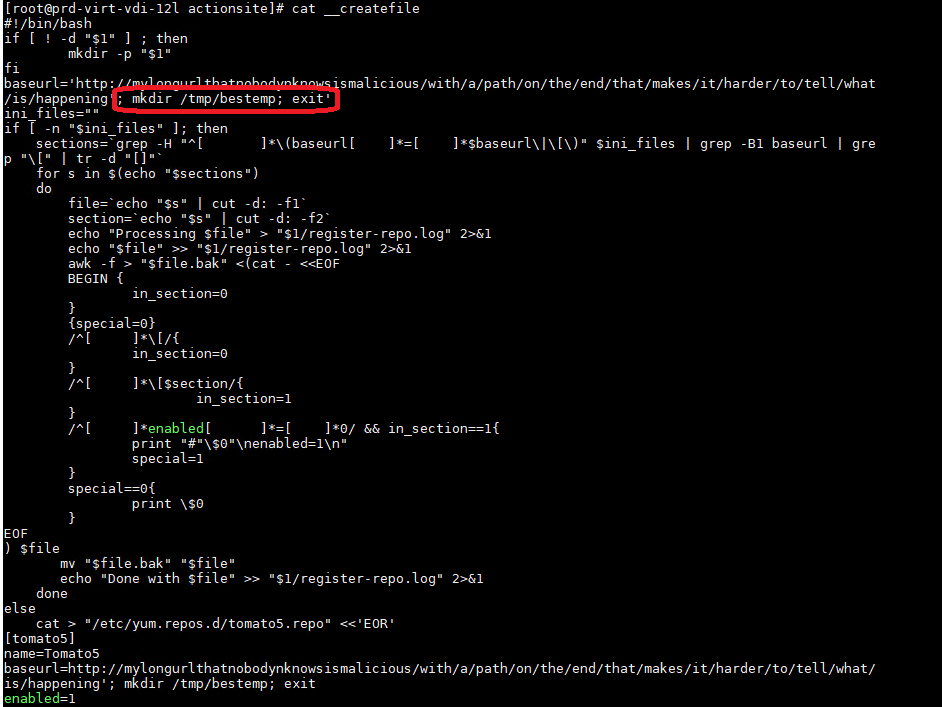

## Background

BigFix is an Endpoint Management tool used by some of the largest organizations in the world. BigFix is a complex suite of tools. This disclosure covers an issue found in the BigFix console that IBM/HCL determined was "as-designed".

## Overview

BigFix Shared Dashboard Variables are a useful mechanism to store data for dashboards, reports, wizards, fixlets, and really just anything where you need to store data that isn't directly from a managed asset.

Historically, Shared Dashboard Variables have been used to store server names, passwords, compliance items, CVE definitions and more.

Dashboard Variables are always scoped to a specific dashboard name `Dashboard.ojo` and have a name `myVariable`. In this way, any dashboard variable can be referenced by the combination of these two items.

The only access control in place is that an operator *must have access to the site the dashboard exists in*.

Some additional implications of this:
* All Console operators can manipulate all dashboard variables
* All REST API users can manipulate all dashboard variables
* Any account created for automation purposes can modify dashboard variables regardless of permissions

## Exploit via Console

The statement above `The only access control in place is that an operator must have access to the site the dashboard exists in.` is actually not true. This check is performed client-side by the BigFix console and is not enforced by the server. If you can find a way to convince the console that you do have that dashboard then you can read/modify any of the corresponding variables.

The initial method I reported was to enable the Console Debug menu and then use `Load Wizard`. IBM responded by removing `Load Wizard` from the Debug menu. This is not a solution.

Alternatively, you can just place a .ojo file with the right name in your console cache `AppData\Local\BigFix\Enterprise Console\bigfix.domain.org\nonmo\Sites\BES Support` and Refresh the console by pressing F5. You now have access to wizard variables for that dashboard -- verify using presentation debugger: `(name of it, value of it, name of wizard of it, name of site of wizard of it) of shared variables of bes wizards`

Finally, you can use the REST methods via the javascript functions API.get, API.put, API.post

```
<script>API.Get("dashboardvariables",  function(error, status, body){alert(body)})</script>
```

## Exploit via REST API

Because the access control for Shared Dashboard Variables is implemented entirely client-side there are no access controls on the REST API and all users with REST API access can read/write all Shared Dashboard Variables.

## Impacted Areas

### Registering a repo on Linux

The following is from the register repo wizard which uses the value from a dashboard variable, injects it directly into a fixlet which runs directly on an asset as part of regular maintenance by an operator. In this example I can store a bash command in the dashboard variable and have it invoked as root on the endpoint.


All Custom Repository Dashboards/Wizards which inject the contents of dashboard variables directly into fixlets are vulnerable.

### SCM Dashboard Compliance Exceptions
The SCM Dashboard uses dashboard variables for Compliance Exception Reporting. An unscrupulous actor could take advantage of this and put in place exceptions that weren't approved by the enterprise.

### OS Deployment

OS Deployment - Image Library: domain passwords, admin passwords are base 16 encoded, bitlocker pin is plain text. Dashboard variables store the settings used for the MDT share that is to be used for re-imaging. Allowing an attacker to swap images, create accounts, etc.

### BigFix.Me Sync Tool
BigFix.me Sync Tool stores username/password in plain text

## Summary

Essentially, Shared Dashboard Variables have zero access control and can be read from and written to by any console or rest api operator, regardless of their granted permissions. Even accounts configured as totally read-only can write to dashboard variables.

HCL makes the argument that this is all by design and that dashboard variables do not and should not store sensitive information.

Here are the places where I believe they are storing sensitive information:
